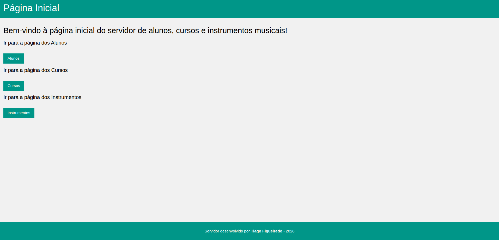

# TCP 3
## Metainformação
- **Título:** Criação de um servidor aplicacional para responder a serviços
- **Data:** 18 fevereiro 2026
- **Autor:** Tiago Figueiredo
- **UC:** Engenharia Web

## Autor
**Nome:** [Tiago Silva Figueiredo](https://github.com/tiagofigueiredo7)

**Número:** a106856


## Resumo
Neste TPC o objetivo foi criar um servidor aplicacional (com interface) que permitisse mostrar os resultados dos pedidos feitos ao servidor de dados (json-server).

Os serviços pedidos são:
- /alunos - Tabela HTML com os dados de todos os alunos
- /cursos - Tabela HTML com os a informação de todos os cursos
- /instrumentos - Tabela HTML com os dados dos vários instrumentos

Foi adicionado um serviço extra,
- /

que leva para uma página inicial da interface, onde daí é possível sermos redirecionados para os serviços principais.

## Lista de Resultados
A resolução deste TPC deu origem aos seguintes ficheiros:

- [musicas.json](musicas.json) : dataset usado para o json-server
- [util.js](utils.js) : ficheiro JavaScript com funções auxiliares
- [interface.js](interface.js) : servidor aplicacional com interface

## Dependências

Para poder correr estes servidores e testes é necessário ter instalado:

- json-server

```
npm install -g json-server@0.17.4
```

- axios

```
npm install axios
```

## Testar



Para testar basta correr os dois servidores (json-server e server aplicacional) com estes comandos respetivamente:

```sh
json-server --watch dataset_reparacoes.json

node interface.js
```

Depois basta no browser procurar por estas rotas

- localhost:25000
- localhost:25000/alunos
- localhost:25000/cursos
- localhost:25000/instrumentos